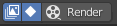

# Render Greace Pencil Only
blender addon to render only greace pencil keyframes

## Installation:

1. Go to  ***edit > preferences > addons > install***

2. Locate the `RenderGPKeyframes.zip` and click `install addon`

3. You'll find the addon in the Animation section. Enable the addon by clicking on the checkmark . In the addon preferences ,tick the place where
you want to access the operator on the UI.

4. Restart Blender : Because the addon modifies blender's `space_dopesheet.py` and `space_view3d.py`, you have to close blender and reopen it again for these files to be reloaded.

---

**Note** : If you are doing the steps above on a installation rather than portable version of Blender, you have to run Blender as ***administrator***, because the `space_dopesheet.py` and `space_view3d.py` are inside Blender's installation folder and on Windows that is `Program Files` folder where depending on your account settings, it may require you to use ***administrator*** privilages to make changes.

**Note** : Because the script modifies the files mentioned above, in case these files get corrupted there is a `backup` folder that contains the origial files backed up every time the script modified them. These go to \<Blender installation Folder>\version folder(example - 2.91)\scripts\startup\bl_ui 

---

## Usage

### Where it is
The addon renders only the greace pencil keyframes as separate images when pressing the button on the dopesheet header:

or the option in the dropdown of the `view` menu in the viewport:

depending on what the user selected in the addon preferences.

### Where it saves

- The addon saves rendered files based on the settings inside Output Properties > Output

- If no name is given to the output file, files will be saved as ***untitled-*** prefix and with sequential numbering as suffix (eg. _0001,0002,0003 etc.)

- If the user adds a name the name will be prefixed instead of ***untitled-***

### How it works

- The addon's behaviour is modified through two toggle buttons - `selected layers` and `selected keyframes`

- When `selected layers` is enabled  :

    It will render only the keyframes for the selected layer/s by modifing the visibility of the other layers while rendering, but restoring their visibility to their state prior the execution of the operator so the user does not notice the change. This applies even if the user has multiple greace pencils and/or layer/s selected outside of the active greace pencil.

    

- When `selected keyframes` is enabled :

    This will render all selected keyframes regardless of layer selection.

    

- When both `selected layers` and `selected keyframes` are enabled  :

    This will render all selected keyframes inside a layer. As with the `selected layers` other layers will be hidden during rendering.

    

- When neither are enabled  :
    
    When there is no `selected layers` or `selected keyframes` enabled, then it renders all keyframes in all grease pencils with all layers visible.

    
